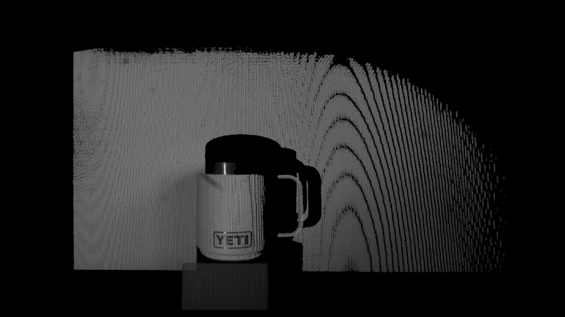
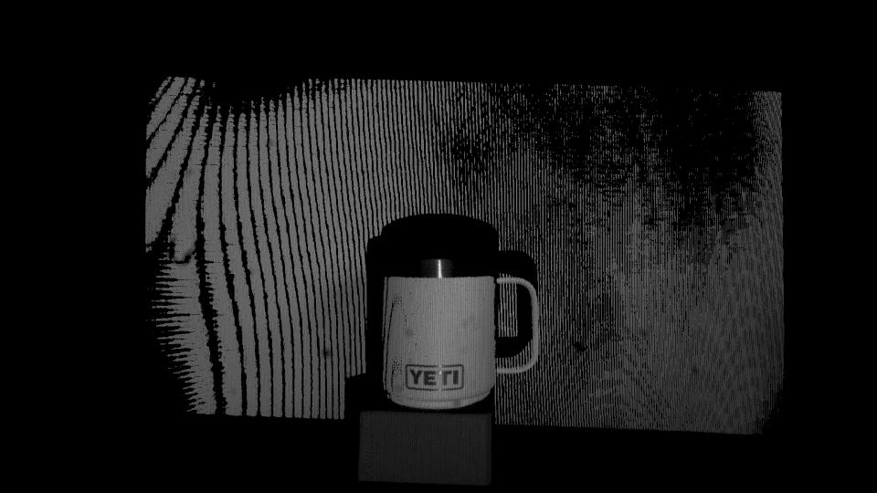
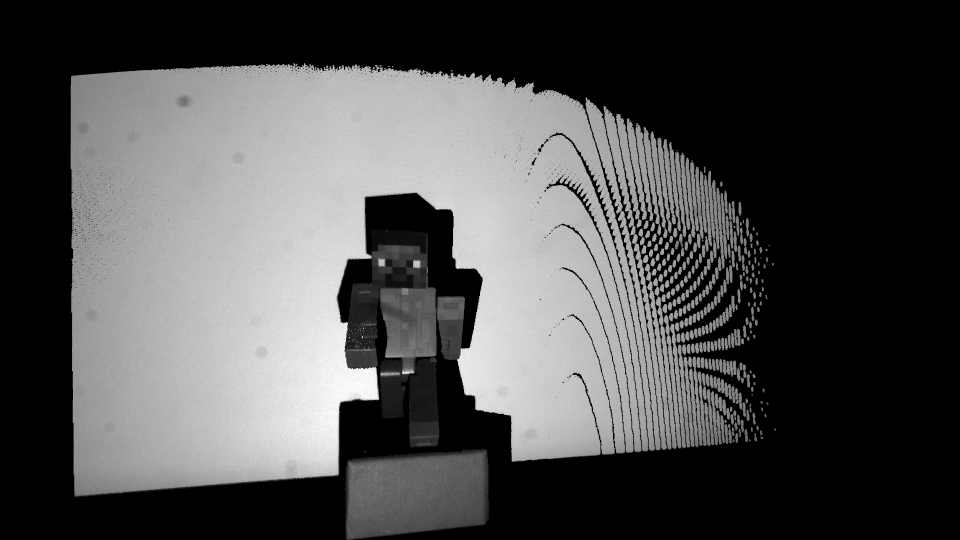
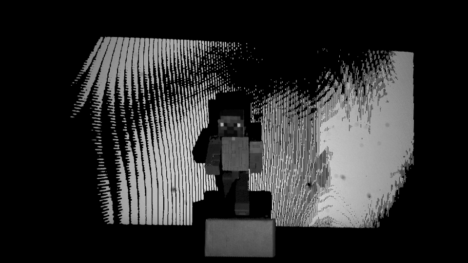

# Structured light algorithm using multiple cameras

Implementation of the structured light algorithm in python using two monochrome cameras and one projector. it is expected that the  camera and projector intrinsic and extrinsic parameters are known.

# Algorithm
- decode gray code pattern.
- clean up invalid pixels in decoded images.
- estimate the parameters of the projected planes.
- calculate the direction of each camera rays originating from a camera center and passing through each pixel.
- find the intersection of camera rays with the projected plane; this intersection yields the coordinates of the object's 3D point.

# Requirements
- intrinsic and extrinsic parameters of the camera
- intrinsic and extrinsic parameters of the projector
- OpenCV
- Open3D

# Examples
## Yeti dataset
### pointclouds

### left and right pointclouds

### joint pointclouds without texture

## Steve (from minecraft) dataset
### pointclouds

### left and right pointclouds

### joint pointclouds without texture

